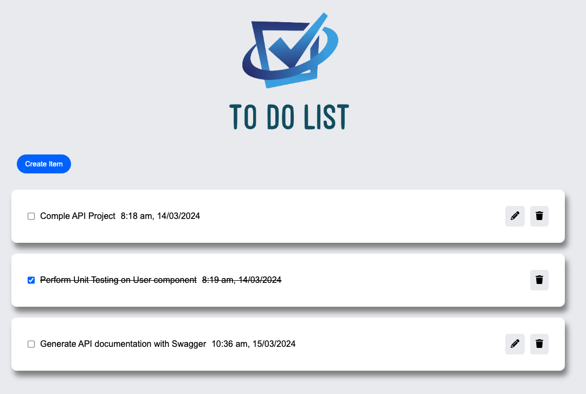

# To Do List Full Stack Application

 

  

 

# Summary

This is a full stack application. A back-end developed in Java and Springboot that can create, update, read and delete todos from a MySQL database. Along with this, a front-end application developed in React that interacts with the back-end.

## Front-end

-    Add, complete, delete and edit todos
-    Typescript & testing with React Test Library
-    All errors handled and passed on properly back to the user through toast notifications

## Back-end

-    All endpoints error handled such that they return the correct status codes and messages.
-    Implements a logging strategy for requests being processed
-    Uses spring swagger to generate documentation for API
